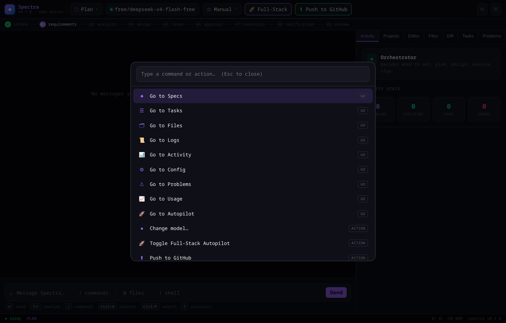
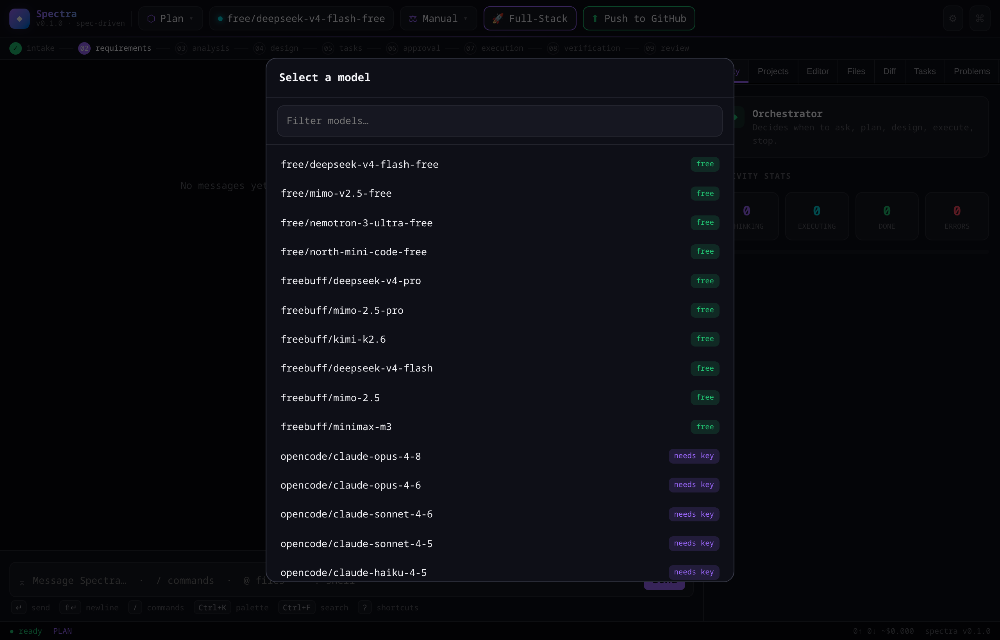
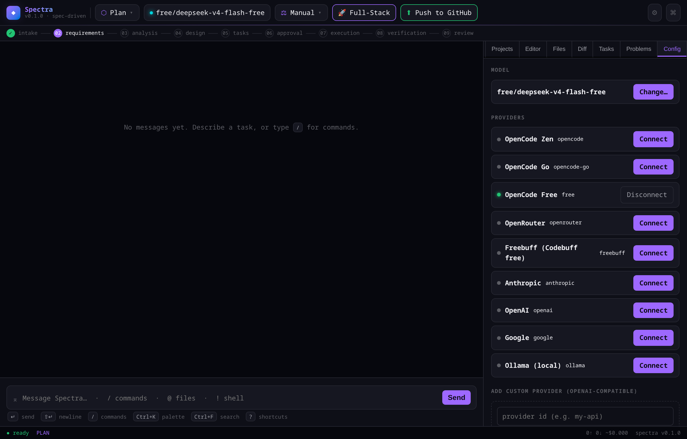
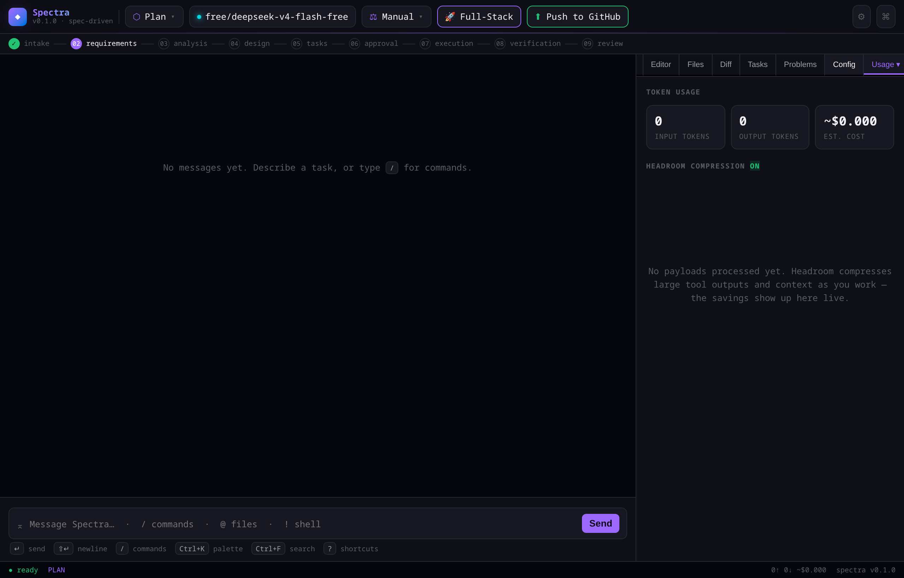
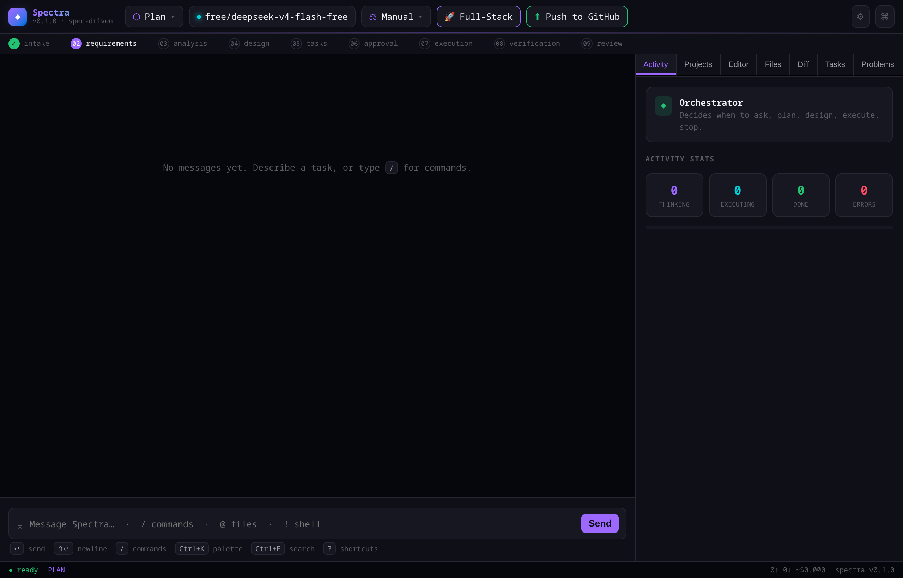

<div align="center">

# ⚡ Spectra

**El agente de programación por IA, guiado por especificaciones, para tu terminal.**

Planifica en *specs*, ejecuta tareas en paralelo y funciona con cualquier proveedor LLM — todo desde una TUI a pantalla completa, una app de escritorio nativa o el navegador.

[](https://github.com/tuangel134/spectra/actions/workflows/ci.yml)
[](LICENSE)


</div>

---

## ✨ ¿Qué es Spectra?

Spectra es un agente de IA que **escribe código de verdad** y trabaja de forma autónoma para completar tareas: lee antes de escribir, hace cambios enfocados, ejecuta build y tests, y nunca deja stubs ni placeholders. Cuando el trabajo es complejo, piensa en **especificaciones** — requirements, design y tasks — y ejecuta las tareas independientes en paralelo.

Además de programar, funciona como **asistente de terminal general**: diagnostica y arregla problemas del sistema (audio, red, drivers, servicios, paquetes) con permisos que piden aprobación antes de cualquier acción privilegiada o destructiva.

## 🎯 Características

- **Spec-driven** — genera `requirements.md`, `design.md` y `tasks.md`, construye un grafo de dependencias y ejecuta las tareas en *waves* paralelas.
- **Multiplataforma** — Linux, macOS y Windows 10/11, con shell y rutas nativas de cada SO.
- **Multi-proveedor** — Anthropic, OpenAI, Google Gemini, Ollama (local, sin clave) o cualquier endpoint compatible con OpenAI vía base URL. Arranca gratis, sin API key.
- **Tres interfaces, un motor** — TUI a pantalla completa, app de escritorio nativa (WebView del SO, sin Chromium empaquetado) y UI web.
- **Herramientas reales** — `read`, `write`, `edit`, `bash`, `grep`, `glob`, `webfetch`, git, diagnósticos LSP, navegador headless y más.
- **Permisos granulares** — `allow` / `ask` / `deny` por patrón de comando; las acciones privilegiadas (sudo/UAC, borrados, servicios) siempre piden confirmación.
- **Sub-agentes** — delega investigación o ediciones acotadas a agentes aislados (`explore`, `review`) sin inflar el contexto principal.
- **Hooks + Steering** — automatiza acciones ante eventos y añade reglas persistentes al proyecto.
- **Sesiones con undo** — snapshots por turno, rebobinado y compactación automática de contexto.
- **Autopilot** — modo de ejecución larga que entrega proyectos completos, verificados y sin esqueletos.
- **283 tests** automatizados (unitarios + integración end-to-end), verdes en Linux, macOS y Windows en CI.

## 📸 Capturas

<div align="center">

| Paleta de comandos (Ctrl+K) | Selector de modelos |
|---|---|
|  |  |

| Configuración | Uso y costos |
|---|---|
|  |  |



</div>

## 📦 Requisitos

- **Node.js >= 20**
- Funciona en **Linux, macOS y Windows 10/11**
- [ripgrep](https://github.com/BurntSushi/ripgrep) (`rg`) recomendado para `grep`/`glob` (hay fallback si no está)
- En Windows los comandos de shell se ejecutan con `cmd.exe`; [Git para Windows](https://git-scm.com/download/win) habilita las herramientas `git`

## 🚀 Instalación

```bash
git clone https://github.com/tuangel134/spectra.git
cd spectra
npm install          # compila automáticamente (script prepare)

# Deja el comando `spectra` disponible globalmente:
npm link
# o, sin permisos de root (Linux/macOS):
ln -sf "$(pwd)/dist/cli.js" ~/.local/bin/spectra
```

En **Windows** usa `npm link` (o `npm install -g .`) desde PowerShell o CMD; el binario `spectra` queda en el PATH de npm automáticamente.

## ⚡ Inicio rápido

La primera vez no te pide nada: arranca con un **modelo gratuito** que funciona **sin API key**. Usa `/connect` (o el selector de modelos) cuando quieras añadir tu propio proveedor.

```bash
spectra            # TUI interactiva a pantalla completa
spectra desktop    # App de escritorio nativa (ventana propia, WebView del SO)
spectra web        # Interfaz web en el navegador
```

Simplemente escribe lo que necesitas — Spectra detecta si es código o un problema del sistema y actúa. No hay que cambiar de modo.

## 🖥️ Comandos CLI

```bash
spectra                  # Lanza la TUI interactiva
spectra run "<prompt>"   # Ejecución one-shot no interactiva
spectra spec "<desc>"    # Genera requirements + design + tasks
spectra run-spec <id>    # Ejecuta las tareas de un spec
spectra ops "<síntoma>"  # Diagnostica y arregla un problema del sistema
spectra desktop          # App de escritorio nativa
spectra web              # Servidor + UI web (puerto 4096)
spectra models           # Lista proveedores y modelos configurados
spectra agent            # Lista los agentes disponibles
spectra eval             # Scorecard de capacidades
spectra init             # Inicializa .spectra/ en el proyecto
spectra --help           # Ayuda
```

## 🔌 Proveedores y modelos

Spectra funciona con cualquier proveedor. Conéctate con `/connect` en la TUI o edita `spectra.jsonc`:

| Proveedor | Ejemplo de modelo |
|---|---|
| Gratis (sin clave) | `free/<modelo>` |
| Anthropic | `anthropic/claude-sonnet-4-5` |
| OpenAI | `openai/gpt-5.1` |
| Google Gemini | `google/gemini-3.1-pro` |
| Ollama (local) | `ollama/llama3.2` |
| Personalizado (base URL) | `mi-api/mi-modelo` |

```jsonc
// spectra.jsonc
{
  "model": "anthropic/claude-sonnet-4-5",
  "provider": {
    "anthropic": {
      "options": { "apiKey": "{env:ANTHROPIC_API_KEY}" }
    }
  }
}
```

### API personalizada / Base URL

Cualquier endpoint compatible con OpenAI:

```jsonc
{
  "model": "mi-api/mi-modelo",
  "provider": {
    "mi-api": {
      "sdk": "openai-compatible",
      "baseURL": "https://tu-host.com/v1",
      "options": { "apiKey": "{env:MI_API_KEY}" }
    }
  }
}
```

## 📐 Desarrollo guiado por especificaciones

El comando `/spec` (o `spectra spec`) genera tres documentos:

1. **requirements.md** — user stories + criterios de aceptación (EARS).
2. **design.md** — arquitectura + diagramas de secuencia + estrategia de tests.
3. **tasks.md** — tareas atómicas con dependencias explícitas.

Luego `spectra run-spec <id>` construye un **grafo de dependencias**, agrupa las tareas en **waves** y ejecuta en paralelo las que no dependen entre sí:

```
Wave 1: #1, #2        (sin dependencias, en paralelo)
Wave 2: #3, #4        (dependen de wave 1)
Wave 3: #5            (depende de #3 y #4)
```

## 🤖 Agentes

| Agente | Modo | Función |
|---|---|---|
| `build` | primary | Asistente general: escribe/ejecuta código y arregla el sistema |
| `plan` | primary | Análisis read-only sin modificaciones |
| `spec` | primary | Genera y ejecuta especificaciones |
| `ops` | primary | Diagnostica y arregla problemas del SO |
| `review` | subagent | Code review sin ediciones |
| `explore` | subagent | Exploración rápida del codebase |

Define agentes propios en `.spectra/agents/*.md`:

```markdown
---
description: Audita seguridad sin hacer cambios
mode: subagent
permission:
  edit: deny
  bash: deny
---

Eres un auditor de seguridad. Busca vulnerabilidades OWASP Top 10.
```

## 🪝 Hooks

Automatizaciones ante eventos en `.spectra/hooks/*.json`:

```json
{
  "name": "Lint on Save",
  "version": "1.0.0",
  "when": { "type": "fileEdited", "patterns": ["*.ts"] },
  "then": { "type": "runCommand", "command": "npm run lint" }
}
```

Eventos: `fileEdited`, `fileCreated`, `fileDeleted`, `promptSubmit`, `agentStop`, `preToolUse`, `postToolUse`, `preTaskExecution`, `postTaskExecution`, `userTriggered`.

## 🔐 Permisos

```jsonc
{
  "permission": {
    "edit": "allow",
    "bash": {
      "*": "allow",
      "npm test*": "allow",
      "rm -rf *": "deny",
      "git push*": "ask"
    }
  }
}
```

Niveles: `allow` (sin aprobación), `ask` (pide confirmación), `deny` (bloqueado). Gana la última regla que coincide. Las acciones privilegiadas o destructivas (sudo/UAC, borrados, servicios, drivers) están gateadas aunque tengas auto-aprobación activada.

## 🧩 App de escritorio nativa

`spectra desktop` arranca el motor y abre una ventana nativa que usa el **WebView del sistema** — WebView2 en Windows, WKWebView en macOS, WebKitGTK en Linux — sin empaquetar Chromium. Si no hay binario nativo compilado, cae limpiamente a un navegador Chromium en modo app y, por último, al navegador por defecto.

Para compilar el binario nativo (opcional, requiere Rust) mira [`desktop-native/README.md`](desktop-native/README.md) con las dependencias por SO.

## 🏗️ Arquitectura

```
spectra/
├── src/
│   ├── cli.ts              # Entry point del CLI
│   ├── runtime.ts          # Ensambla todos los subsistemas
│   ├── config/             # Carga y merge de configuración JSONC
│   ├── provider/           # Clientes LLM (anthropic, openai, registry, routing)
│   ├── agent/              # Definiciones de agentes y registry
│   ├── tool/               # read, write, edit, bash, grep, glob, webfetch, git…
│   ├── permission/         # Evaluación de permisos
│   ├── session/            # Sesiones, snapshots, agent loop y compactación
│   ├── spec/               # Spec engine: parser, grafo, ejecución en waves
│   ├── autorun/            # Autopilot (long-running) + verificación
│   ├── hook/  steering/    # Hooks event-driven + reglas persistentes
│   ├── mcp/  lsp/  skill/  # MCP, diagnósticos LSP, skills
│   ├── headroom/           # Compresión de contexto
│   ├── server/  web/       # API HTTP + UI web
│   ├── tui/                # Interfaz de terminal a pantalla completa
│   ├── desktop/            # Launcher de la app nativa
│   └── util/               # platform (cross-OS), logger, glob, ids
├── desktop-native/         # Ventana nativa en Rust (wry/tao)
├── test/                   # 283 tests (node:test)
└── spectra.example.jsonc   # Config de referencia
```

## 🛠️ Desarrollo

```bash
npm run build       # Compila a dist/
npm run typecheck   # Type-check sin emitir
npm test            # Ejecuta los 283 tests (multiplataforma)
npm run dev -- ...  # Ejecuta desde TypeScript sin compilar
npm run eval        # Scorecard de capacidades
```

## 🤝 Contribuir

Los issues y pull requests son bienvenidos. Antes de enviar un PR, asegúrate de que `npm run typecheck` y `npm test` pasen en verde.

## 💛 Apoya el proyecto

Si este proyecto te es útil y quieres ayudar a que siga mejorando, puedes apoyar con una donación:

**PayPal**
[`https://paypal.me/tuangel1346`](https://paypal.me/tuangel1346) · `tuangel1346@gmail.com`

**Criptomonedas (Bitcoin)**
```
bc1q5nrv64jchep3hpqptvwmume8rkw68937zftfpa
```

Tu apoyo ayuda a mantener el desarrollo, mejorar la documentación y portar a más plataformas. ¡Gracias! 🙏

## 👤 Autor

**Angel Collazo**
GitHub: [@tuangel134](https://github.com/tuangel134)

## 📜 Licencia

Publicado bajo la licencia MIT. Mira [`LICENSE`](LICENSE).

---

<div align="center">
<sub><strong>Spectra</strong> — Piensa en specs. Ejecuta en paralelo. Desde tu terminal. ⚡</sub>
</div>
